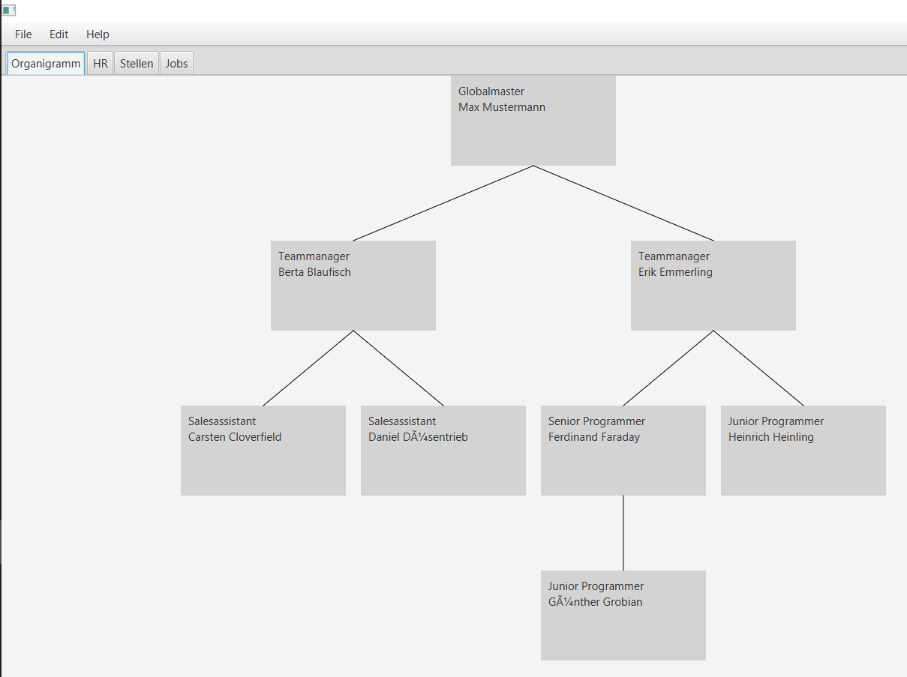
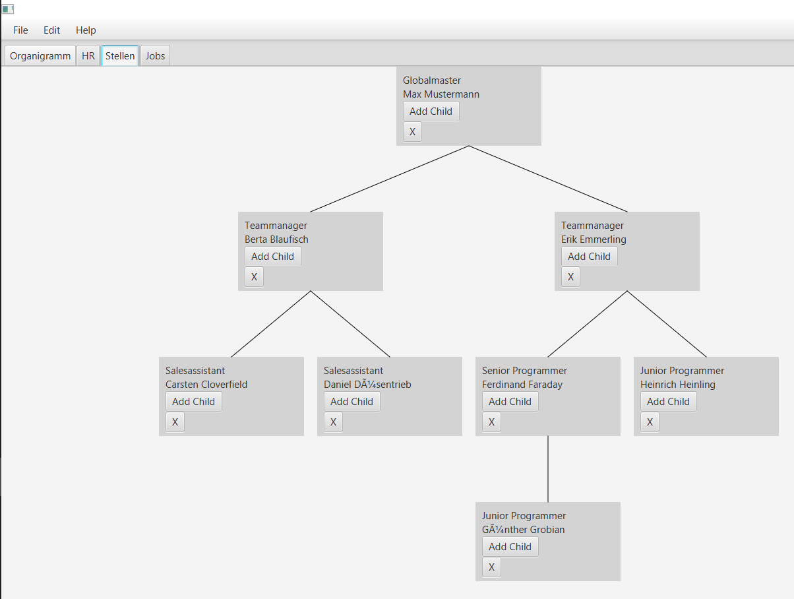
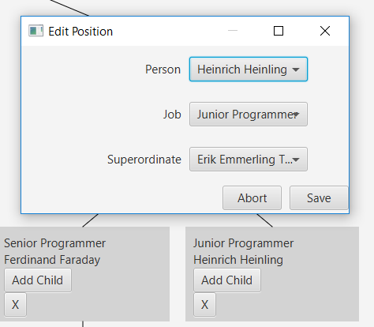
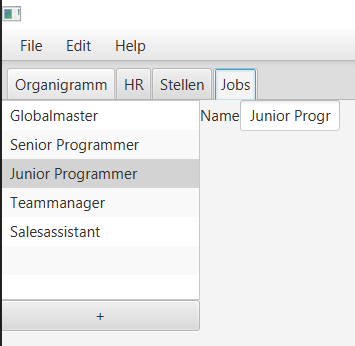
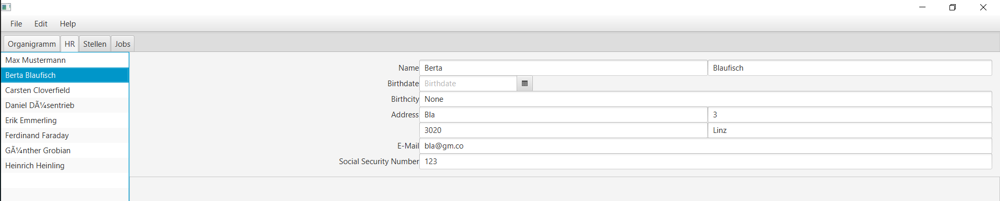

# BOBW-Organisation
Ein Programm zum Editieren von Organigrammen von
 * Erik Mayrhofer
 * Jan Neuburger
 * Maximilian Wahl
 * Joules Munoz
 * Florian Schwarcz

## Allgemeines
In diesem Projekt arbeiteten einerseits das Frontend-Team (Mayrhofer, Neuburger, Munoz) und das Backend-Team (Wahl, Schwarcz). Das Frontend wurde mit JavaFX realisiert, während das Backend-Team mit Java, DerbyDB und JDBC arbeitete.

## Tabs
Unser Programm ist in mehrere Tabs aufgeteilt, die hier mit Screenshots vorgestellt werden.

Es gibt 2 Versionen der Ansicht des Organigramms. Im Organigramm-Tab sieht man eine unveränderliche Version der Aufbauorganisation. Für Personen mit Bearbeitungsrechten gibt es den Stellen-Tab, bei dem man Positionen löschen und untergeordnete Positionen hinzufügen kann.

Der erste Screenshot zeigt ein Dialogfenster, welches erscheint, wenn man im Stellen-Tab auf eine Position doppelklickt. Darin könenn den Positionen andere Vorgesetzte zugeordnet werden, sowie der Job und die Position aus einer Liste der Verfügbaren ausgewählt werden.

Im zweiten Screenshot sieht man den Jobs-Tab, in dem man eine Liste der ganzen Jobs hat. Unter der Liste kann man Jobs hinzufügen.

Der HR-Tab beinhaltet das Bearbeitungsmenü für die angestellen Personen, in dem man alle Daten ändern kann. Werden die Daten in den Feldern verändert, geht dies direkt auf das Backend über.